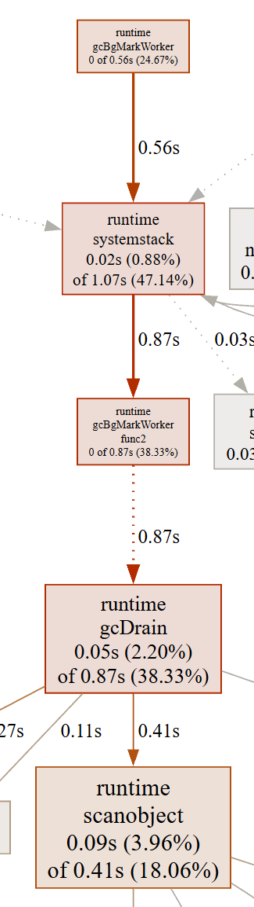
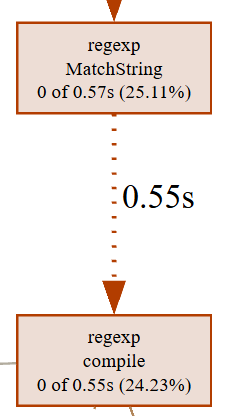
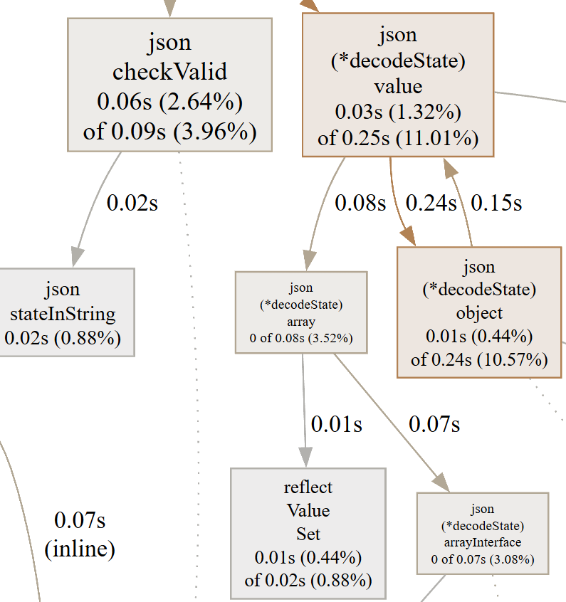
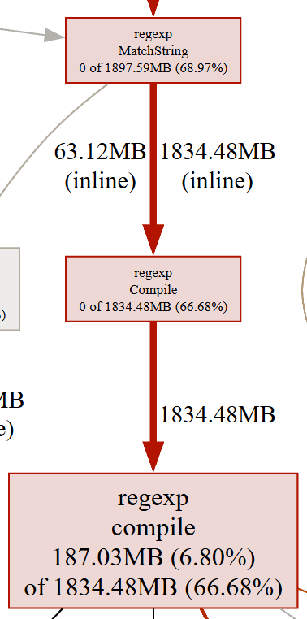
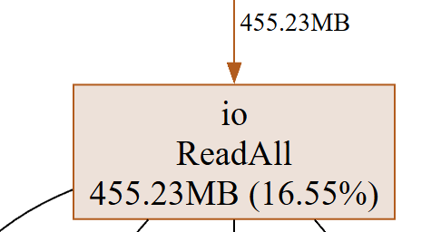

# Отчет

С помощью встроенного бенчмарка и профайлера pprof в Go можно отладить и найти уязвимые места,
утечки памяти, горутин, блокировки и тд.

Оптимизировать будем функцию `SlowSearch` из файл `common.go`. Результат будет записан в функцию `FastSearch` файл `fast.go`

## На что обращаем внимание

Для начала стоит определить, что мы вообще ищем. Три основные характеристики на которые я буду опираться при поиске слабых мест:
Процессорное время, Кол-во памяти, Кол-во аллокаций памяти.

Все эти три характеристики буду рассматривать в контекстах на весь скрипт/на одну операцию/на функцию

## Определение ресурсозатратных мест

Буду рассматривать сразу параллельно и нагрузку на процессор и на память

### Бенчмарк

Так сказать верхний срез для просмотра чего у нас там происходит, можем сделать с помощью бенчмарка.
На этом этапе функция `FastSearch` не оптимизирована и просто вызывает функцию `SlowSearch`

```bash
$ go test -bench . -benchmem
BenchmarkSlow-12              78          14994477 ns/op        20390737 B/op     182851 allocs/op
BenchmarkFast-12              79          15329568 ns/op        20412846 B/op     182855 allocs/op
PASS
ok      hw3     2.613s
```

- Количество выполненных операций ~78
- Времени уходит на 1 операцию ~15_000_000 наносекунд (примерно 0.15с)
- Количество аллокаций памяти на одну операцию ~180_000

Если не вдаваться в подробности кода, смущает здесь цифра "Количество аллокаций памяти" в 180тыс. слишком много,
если еще учесть что это бенчмарк одной функции, которая может быть конечно большой

### pprof

Для построения визуального отображения затрачиваемых ресурсов в Go есть утилита pprof, также необходимо установить Graphiz.
С помощью Graphiz-а можно удобно сохранять или выводить в браузер профайлы

- Сформировать профайл по CPU или Memory можно с помощью команд

```bash
$ go test -bench=BenchmarkFast -cpuprofile cpu.out
BenchmarkFast-12              85          14458973 ns/op
PASS
ok      hw3     1.746s
$ go test -bench=BenchmarkFast -memprofile mem.out
BenchmarkFast-12              75          14914597 ns/op
PASS
ok      hw3     2.338s
```

- Дальше для работы с профайлом переходим в режим работы в CLI.

```bash
$ go tool pprof cpuout cpu.out
Type: cpu
Time: Nov 5, 2025 at 10:00pm (MSK)
Duration: 1.43s, Total samples = 2.27s (158.37%)
Entering interactive mode (type "help" for commands, "o" for options)
(pprof)
```

- Пока что интересует веб-отчёт, вводим `(pprof) web`

## Оптимизация

### CPU

В этом разделе буду приводить скриншоты из веб-отчёта pprof конкретных мест, которые на мой взгляд требуют оптимизации.
Глобально рассматривать утилиты и результаты не буду

Самые большие узлы, которые можно найти на графе, это вот эти. Судя по сокращениям это похоже на сборщик мусора *(англ. Garbage Collector, сокращ. GC)*.
Если вспомнить кол-во аллокаций, в целом может быть похоже на правду. Пока что оставим это наблюдение и будем параллельно думать о том, где можно это оптимизировать



Следующее, что бросается в глаза это использование регулярных выражений для поиска подстроки. Во-первых при каждом вызове функции мы компилируем регулярку, что судя по графу занимает большую часть времени всего использования регулярного выражения (компиляция + поиск подстроки). Да и поиск идет не какой-то замудренной подстроки, можно будет попробовать заменить на `strings.HasPrefix` или `strings.Contains`



```go
// ...
if ok, err := regexp.MatchString("Android", browser); ok && err == nil {
// ...
if ok, err := regexp.MatchString("MSIE", browser); ok && err == nil {
// ...
```

Также еще много ресурсов тратиться на парсинг json-a в пустой интерфейс. Не уверен как это можно исправить, возможно подготовить готовую структуру с необходимыми полями



### Memory

Тут все конечно поинтересней выглядит, сразу в глаза бросается регулярное выражение которое почти 2000MB заняло. Теперь одназначно будем избавляться от него



Также немного выделяется функция `ReadAll` из пакета `io`, который на данный момент уже устарел. Можно попробовать заменить его на буферизированный ввод вывод



Также хочеться отметить, как происходит обработка данных, большая часть кода опущена, но суть не в нем. В вызове большого числа циклов, что тоже можно оптимизировать

```go
for _, line := range lines {
    // парсинг json чтение юзеров и запись в массив users
}

for i, user := range users {
    browsers, ok := user["browsers"].([]interface{})

    for _, browserRaw := range browsers {
        // Проверка что браузер андроид
    }

    for _, browserRaw := range browsers {
        // Проверка что браузер еще какой-то
    }

    if !(isAndroid && isMSIE) {
        continue
    }

    email := r.ReplaceAllString(user["email"].(string), " [at] ")
    foundUsers += fmt.Sprintf("[%d] %s <%s>\n", i, user["name"], email)
}
```

## Первый результат

Небольшая поправка: для десериализации был использован пакет "github.com/mailru/easyjson"